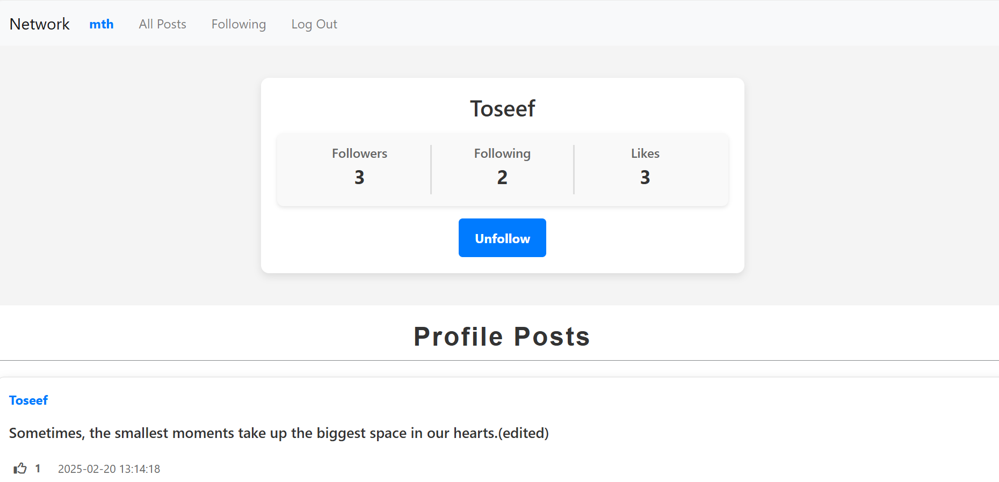

# Network

Network is a Django-based social networking platform similar to Twitter.

## Features

- User Authentication (Signup, Login, Logout)
- Create new posts
- View all posts (with pagination)
- View user profiles
- Follow/Unfollow users
- View posts from followed users
- Like and unlike posts
- Pagination for post listings

## Technologies

- Python
- Django
- HTML/CSS
- JavaScript

## Interfaces

### All Posts


### Following's Posts


### Profile



## Setup Instructions

### Clone the repository
```bash
git clone https://github.com/joiya514/Network-Django.git
cd network
```

### Create a virtual environment and activate it
```bash
python -m venv venv
venv\Scripts\activate 
```

### Install dependencies
```bash
pip install -r requirements.txt
```

### Run database migrations
```bash
python manage.py makemigrations
python manage.py migrate
```

### Start the development server
```bash
python manage.py runserver
```

### Open in your browser
```bash
http://127.0.0.1:8000/
```
